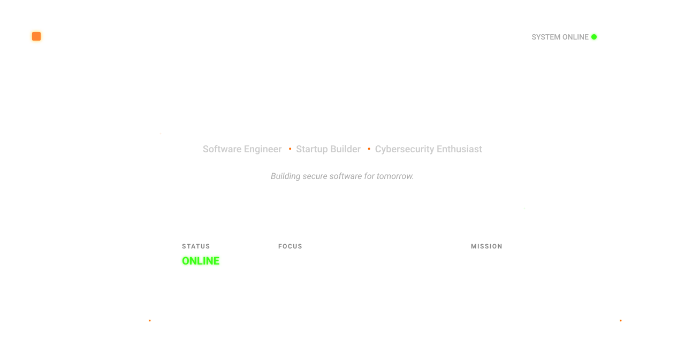

<div align="center">




</div>

<br>

<div align="center">
  <a href="https://www.linkedin.com/in/svk-vasanthkumar" target="_blank">
    
  </a>
  <a href="https://x.com/its__svk" target="_blank">
    
  </a>
  <a href="https://www.instagram.com/svk__vasanthkumar/" target="_blank">
    
  </a>
  <a href="https://www.hackerrank.com/profile/vasanth636807" target="_blank">
    
  </a>
  <a href="https://github.com/svk-vasanthkumar" target="_blank">
    
  </a>
</div>

<br>

## 👨‍💻 About Me

```bash
svk@kascore:~$ whoami --verbose

┌──────────────────────────────────────────────┐
│  Name       : Vasanthkumar S                  │
│  Role       : IT / Software Engineering Student│
│  Focus      : Cybersecurity • Web Development │
│  Exploring  : Cloud • Backend • AI Systems     │
│  Mindset    : Build. Break. Secure. Repeat.    │
│  Mission    : Ship secure, reliable software   │
└──────────────────────────────────────────────┘

svk@kascore:~$ status
[ONLINE] Learning daily and shipping code 🟠
```

<br>

## 🧠 Tech Arsenal

<table align="center">
<tr>
<td valign="top" width="33%">

**Programming**
<br>


</td>
<td valign="top" width="33%">

**Frontend**
<br>


</td>
<td valign="top" width="33%">

**Backend & DB**
<br>


</td>
</tr>
<tr>
<td valign="top" width="33%">

**Cloud & Deploy**
<br>


</td>
<td valign="top" width="33%">

**Tools**
<br>


</td>
<td valign="top" width="33%">

**Design & Notes**
<br>

<br>


</td>
</tr>
</table>

<br>

## 📊 System Diagnostics

<div align="center">


<br>


<br>


</div>

<br>

<div align="center">

━━━━━━━━━━━━━━━━━━━━━━━━━━━━━━━━━━━━━━━━━━━

**Thanks for visiting.**
See you in the next commit. 🟠


</div>
