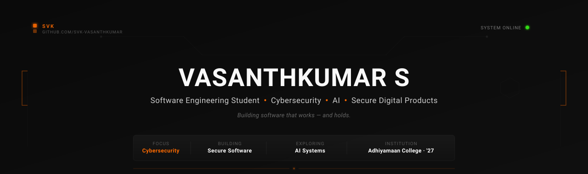
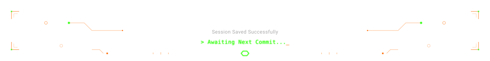

<div align="center">

<picture>
  <source media="(prefers-color-scheme: dark)" srcset="assets/banner.svg">
  <source media="(prefers-color-scheme: light)" srcset="assets/banner.svg">
  
</picture>

<br/>

<!-- Typing animation — clean and on-brand -->


<br/><br/>

<!-- Social links -->
<a href="https://www.linkedin.com/in/svk-vasanthkumar" target="_blank">
  
</a>
<a href="https://x.com/its__svk" target="_blank">
  
</a>
<a href="https://www.instagram.com/svk__vasanthkumar/" target="_blank">
  
</a>
<a href="https://www.hackerrank.com/profile/vasanth636807" target="_blank">
  
</a>
<a href="https://github.com/svk-vasanthkumar" target="_blank">
  
</a>

</div>

<br/>


<br/>

## `$ whoami`

```
┌─[ svk@github ]──────────────────────────────────────────────────┐
│                                                                  │
│   Name      :  Vasanthkumar S                                    │
│   Handle    :  SVK                                               │
│   Role      :  B.Tech IT Student — Adhiyamaan College of Eng.   │
│   Focus     :  Cybersecurity  ·  AI Systems  ·  Full-Stack      │
│   Mindset   :  Build it. Secure it. Ship it.                     │
│   Currently :  Internships at Vodafone VOIS + FICE Education     │
│                                                                  │
│   I don't just study software — I build it.                      │
│   Lately focused on practical security tools and AI agents       │
│   that do actual useful work.                                    │
│                                                                  │
└──────────────────────────────────────────────────────────────────┘
```

<br/>


<br/>

## `$ ls ./toolbox`

<table>
<tr>
<td valign="top" width="50%">

**Languages**
<br/>


**Frontend**
<br/>


**Backend & Database**
<br/>


</td>
<td valign="top" width="50%">

**AI / ML**
<br/>


**Cybersecurity & Tools**
<br/>


**Cloud & Deploy**
<br/>


</td>
</tr>
</table>

<br/>


<br/>

## `$ cat ./projects`

<!-- ─────────────────────────────────────────────────────────────────── -->
<!-- PROJECT 1 -->
<!-- ─────────────────────────────────────────────────────────────────── -->

<table>
<tr>
<td width="8" style="background:#FF6A00; border-radius:4px;"> </td>
<td>

### 🔐 Secure Image Steganography
`Cybersecurity` `Cryptography` `Python`

Hides encrypted payloads **inside ordinary images** using AES-256 encryption combined with LSB steganography. The carrier image is indistinguishable from its original — the hidden data is password-protected and inaccessible without the correct key.

**Why it matters:** Demonstrates applied cryptographic thinking — not just encrypting data, but concealing its existence.

`Python` · `AES-256` · `Pillow` · `Cryptography`

[](https://github.com/svk-vasanthkumar/Secure-Image-Steganography)

</td>
</tr>
</table>

<br/>

<!-- PROJECT 2 -->
<table>
<tr>
<td width="8" style="background:#FF6A00; border-radius:4px;"> </td>
<td>

### 🛡️ AI-Based Network Intrusion Detection
`AI × Security` `Machine Learning` `Network`

ML pipeline that classifies **network traffic as benign or malicious** using the KDD Cup dataset. Trains and benchmarks multiple classifiers to find the most accurate IDS candidate — with a focus on minimising false negatives in real network conditions.

**Why it matters:** Bridges machine learning with practical network security — the kind of thinking that underlies modern SIEM and threat detection systems.

`Python` · `Scikit-learn` · `Pandas` · `Network Analysis`

[](https://github.com/svk-vasanthkumar/AI-Based-Network-Intrusion-Detection)

</td>
</tr>
</table>

<br/>

<!-- PROJECT 3 -->
<table>
<tr>
<td width="8" style="background:#FF6A00; border-radius:4px;"> </td>
<td>

### 🤖 Student Research Agent
`AI Engineering` `LLM` `Agentic Systems`

An AI agent that **decomposes academic research queries** into sub-tasks, fetches and evaluates sources, then synthesises structured summaries — reducing literature review overhead significantly.

**Why it matters:** Practical application of agentic AI patterns: tool use, planning, and structured output — not just API wrapping.

`Python` · `LLM APIs` · `Agentic AI` · `Cloud`

[](https://github.com/svk-vasanthkumar/Student-Research-Agent)

</td>
</tr>
</table>

<br/>


<br/>

## `$ diagnostics --github`

<div align="center">


<br/>


<br/>


</div>

<br/>


<br/>

## `$ git log --contributions`

<div align="center">

<!-- Snake contribution animation — generated by GitHub Actions -->
<!-- Light and dark mode variants -->
<picture>
  <source media="(prefers-color-scheme: dark)" srcset="https://raw.githubusercontent.com/svk-vasanthkumar/svk-vasanthkumar/output/github-contribution-grid-snake-dark.svg"/>
  <source media="(prefers-color-scheme: light)" srcset="https://raw.githubusercontent.com/svk-vasanthkumar/svk-vasanthkumar/output/github-contribution-grid-snake.svg"/>
  
</picture>

</div>

<br/>


<br/>

## `$ ping ./connect`

<div align="center">

I'm always open to engineering conversations, internship opportunities, and collaboration on security or AI projects.

<br/>

<a href="https://www.linkedin.com/in/svk-vasanthkumar" target="_blank">
  
</a>
<a href="mailto:<!-- ADD YOUR EMAIL HERE -->" target="_blank">
  
</a>
<a href="https://x.com/its__svk" target="_blank">
  
</a>

</div>

<br/>

<div align="center">

</div>
